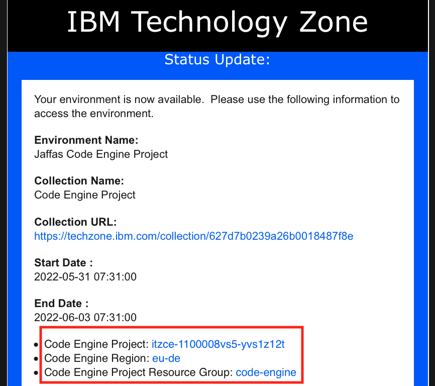
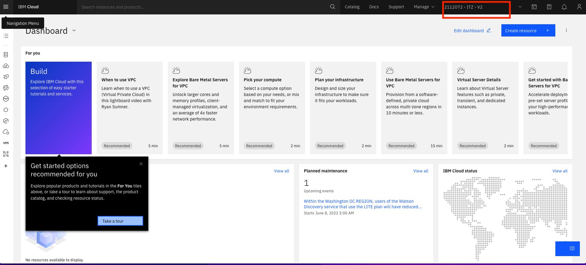
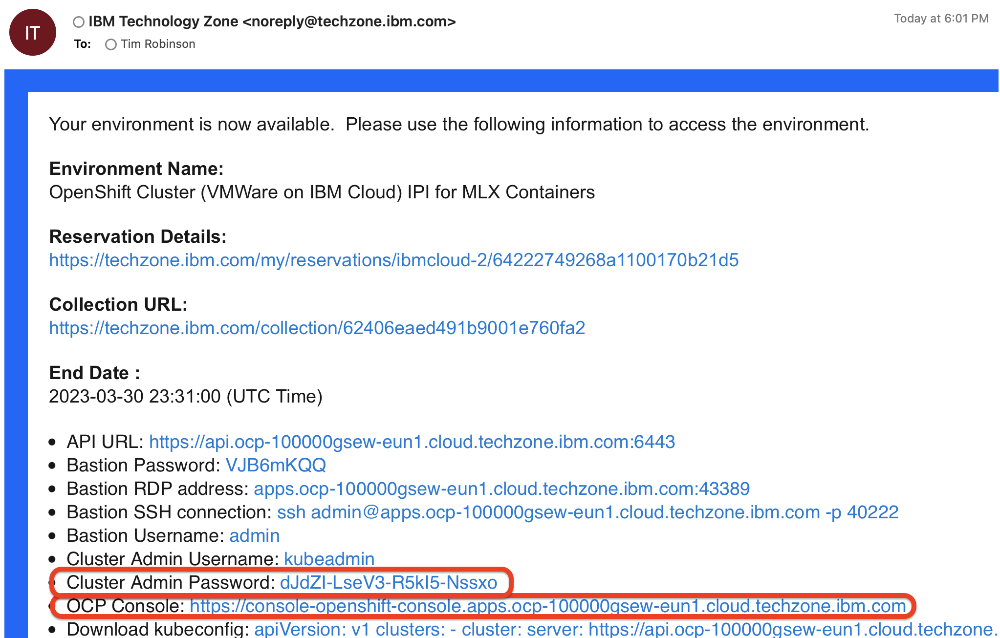
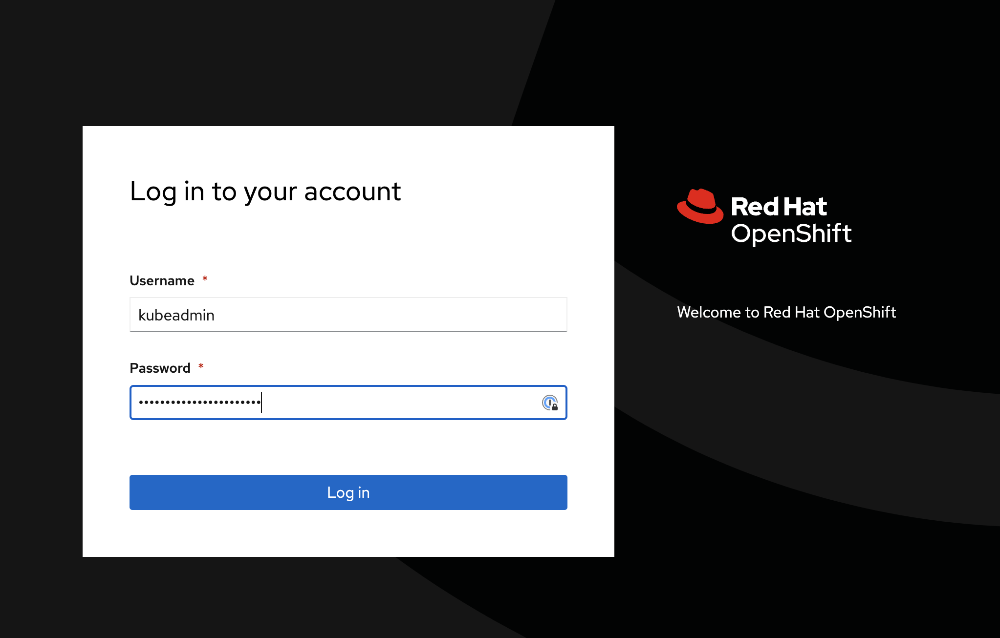
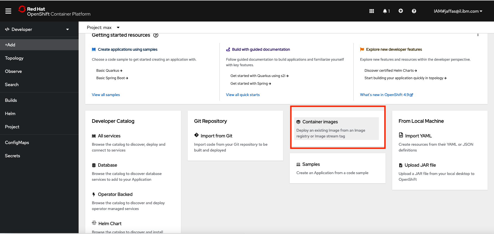

# Deploy a Model Learning Exchange container three ways

The Lab is based on <https://github.com/IBM/MAX-Object-Detector#deploy-on-red-hat-openshift> 

We will deploy the Object Detector Model in three enviroments :

1. Deploy with Docker on local 
1. Deploy on Code Engine  
1. Deploy on Red Hat OpenShift  

## 1) Deploy with Docker on local

To run the docker image, which automatically starts the model serving API, run:

`$ docker run -it -p 5000:5000 quay.io/codait/max-object-detector`

This will pull a pre-built image from the Quay.io container registry (or use an existing image if already cached locally) and run it. If you'd rather checkout and build the model locally you can follow  <https://github.com/IBM/MAX-Object-Detector#run-locally>

## 2) Deploy on Code Engine

### Reserve a Code Engine project

1. [Reserve a Code Engine Project:](techzone.md)

2. You will get a few emails with information about your environment. Please notice that email that is inviting you to join an account in IBM Cloud  and follow the instructions and accept the invitation. Also notice an email stating "Your environment is ready"  follow the links it will take you to your environment "My reservations" .
3. Please notice the Project name, Region and Resource Group. 

3. Login to IBM Cloud and make sure you are working on the right IBM Account that you where just invited to 

## Go to Code Engine and start working
 
1. From the IBM Cloud dashboard choose Code Engine from the left side bar 

this is the Code Engine User Interface , you will be able to deploy apps from here, but we will start first deploying applications using the CE CLI.
2. Click on the  IBM Cloud Shell (at the right side of the screen), IBM CLoud Shell has all the needed CLI's installed .
  
3. Target a resource group by running the following command, and use the resource group according to the email that you got
`ibmcloud target -g code-engine`
  
4. Target the  Code Engine  project that was created for you as instructed in the email  
`ibmcloud ce project target --name  itzce-1100008vs5-yvs1z12t`

itzce-1100008vs5-yvs1z12t is an example you need to put the project name that you got as instructed in the email 

5. Run the container by pointing to the quay.io image and exposting port 5000.

`ibmcloud ce application create --name max-object-detector --image quay.io/codait/max-object-detector --port 5000`

6. Open the resulting URL in a browser, append /app to view the app instead of the API.

## 3) Deploy on Openshift - follow the instructions below 

## Reserve a Managed OpenShift cluster:

1. [Reserve an Openshift Cluster](https://techzone.ibm.com/collection/Easy-to-deploy-containers/environments)

2. Select the **OpenShift Cluster (VMWare on IBM Cloud) IPI for MLX Containers** tile and use all default settings, selecting the preferred region for your cluster. After the cluster is provisioned, you will get an e-mail message with the OpenShift Cluster URL and the `kubeadmin` user password.

## Access the Cluster

### Choose to work with Developer View

### Go to Create Project

### Create Project by the name of `max-deployments`

### Choose from Docker image

### Enter codait/max-object-detector as Image name and click on tab so other fileds will be fields accordingly and then click on the Create button

### Click on the round image 

### Click on the route to run the model

