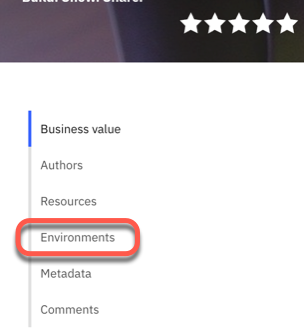
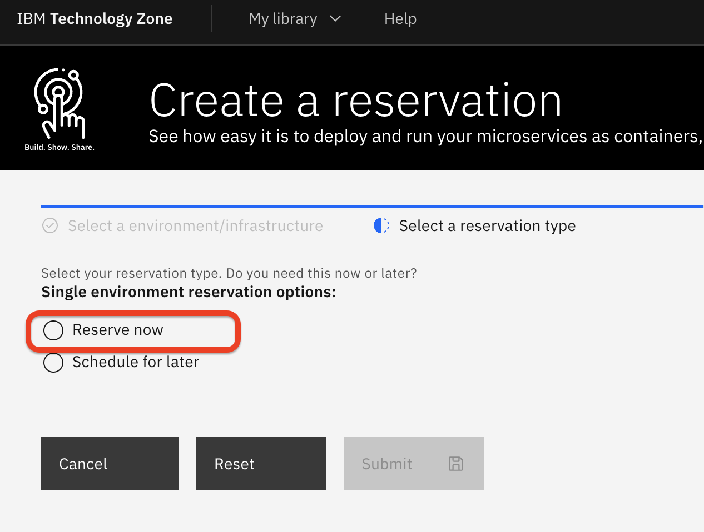
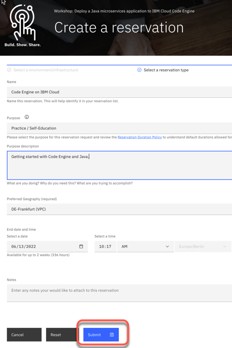
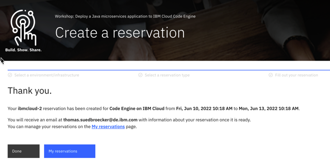
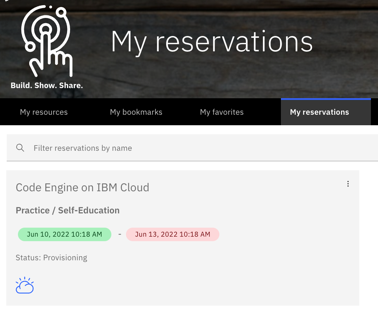
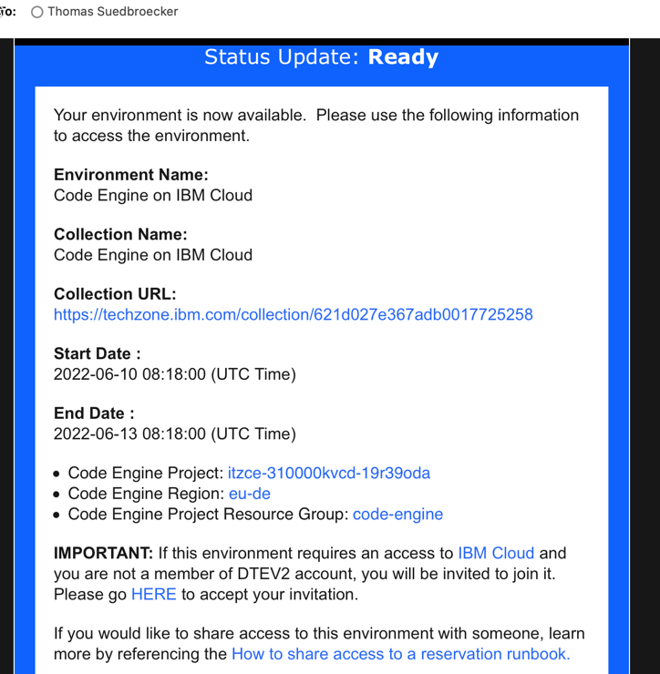
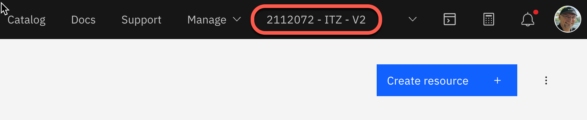

# Reserve a TechZone environment

> TechZone environments are available to Business Partners and IBMers through ibmid activated to <https://techzone.ibm.com>

## Step 1: Open the [TechZone asset](https://techzone.ibm.com/collection/Easy-to-deploy-containers)

## Step 2: Select the environments section of the asset

## Step 3: Create a reservation

Choose the **Code Engine for MLX Containers** environment and click on **Reserve**, then for `Create a reservation` choose `Reserve now` for your reservation

## Step 4: Fill out the reservation form and press `Submit`

## Step 5: Verify your reservation confirmation

## Step 6: Verify the status of your reservation

## Step 7: Verify the email you got from Techzone

In the mail you will find the relevant information for the IBM Cloud environment you got for that workshop.

## Step 8: Ensure you are in the IBM Cloud account

> Note: If this doesn't work, please verify the content of your mail again.
